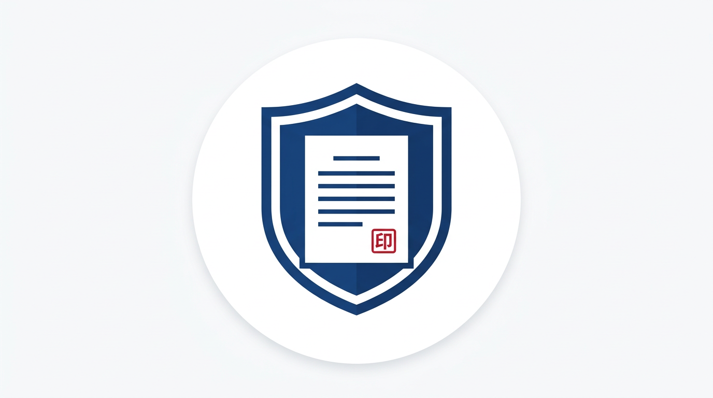

# Fudan University Official Document Templates

<p align="center">
  
</p>

<p align="center">
  <strong>Standard · Efficient · Open Source</strong>
</p>

---

This organization maintains and shares **official document templates for Fudan University**, covering common formats used in administration, teaching, research, and other campus scenarios—helping faculty and students produce compliant documents quickly.

## Template Categories

| Category | Description |
|----------|--------------|
| Administrative | Notices, circulars, requests, reports, approvals, letters, etc. |
| Academic Affairs | Course applications, grade corrections, enrollment changes, etc. |
| Research Management | Project proposals, final reports, budget templates, etc. |
| Student Affairs | Certificates, application forms, recommendation letters, etc. |
| Meeting Documents | Minutes, agendas, resolutions, etc. |

## Features

- **Compliant** — Follow Fudan University’s official document formatting requirements
- **Multi-format** — LaTeX, Word (docx), Typst, and more
- **Ready to use** — Download and fill in, with brief instructions included
- **Up to date** — Kept in line with the latest university guidelines

## Repository Naming Convention

```
fudan-<category>-template
```

Examples:

- `fudan-notice-template` — Notice template
- `fudan-report-template` — Report template
- `fudan-thesis-template` — Thesis template

## Contributing

Contributions from Fudan faculty, students, and alumni are welcome. Open an issue or submit a pull request for new template ideas or improvements.

## License

Templates in this organization are released under [CC BY 4.0](https://creativecommons.org/licenses/by/4.0/) by default, unless otherwise stated in each repository.
